你是否遇到过这种情况：在网页上看到了一堆有用的数据（比如数据表单、排行榜、或者社交媒体评论），想要把它们保存下来分析，但手动复制粘贴太慢了？

这时候，你需要的是**直接与后端服务器对话**，从后端抓取数据。

很多人把这叫做“写爬虫”，但更专业的说法是**API 逆向**或**后端数据抓取**。今天，我们就抛开复杂的各种自动化浏览器工具（如 Selenium、Playwright），回归本质，聊聊如何像浏览器一样，通过代码直接向服务器索要数据。

我将以获取 **PTA 排行榜** ~~(视奸小登进度)~~ 和 **反代 Antigravity** 的 API 为例。
### 前端是怎么和后端通信的？
#### HTTP 协议

浏览器和服务器之间的交流是基于 **HTTP 协议**（HyperText Transfer Protocol）的。

- **客户端/浏览器：** “我要请求一个 API 获取数据。” —— **请求 (Request)**
- **服务器：** “好的，这是您的数据。” —— **响应 (Response)**
#### WebSocket 协议

**WebSocket** 是一种在单个 TCP 连接上进行**全双工**通信的协议。它让服务器能够**主动**向浏览器推送数据。

- **握手阶段（HTTP）：**
    - **客户端：** “我想升级成 WebSocket 协议。”
    - **服务器：** “没问题，协议升级成功。”
- **通信阶段（双向）：**
    - **客户端：** “我发个消息给你。”
    - **服务器：** “收到，我也传给你个新消息。”
    - （连接一直保持，双方可以随时互发数据，不需要重新建立连接）


#### 核心概念

要骗过服务器，让他以为你是浏览器，你需要构造一个完美的请求。一个请求通常包含以下关键部分：

- **URL (统一资源定位符):** 你要去哪里找数据（比如 `https://api.example.com/data`）。
- **Method:**
    - **GET:** 最常用。意思是“把数据拿给我看”。（比如浏览网页）。
    - **POST:** 意思是“把我的数据提交上去”。（比如登录、提交表单）。


- **Headers:** 这部分最关键！这是你向服务器展示身份的地方。
	- `Authorizaton`: 一般是`Bearer <token>`，用来验证身份
    - `User-Agent`: 告诉服务器你是谁（是浏览器还是脚本？**伪装这个**）。
    - `Referer`: 告诉服务器你是从哪个页面跳转过来的（防盗链常用）。
    - `Content-Type`: 告诉服务器你发过去的数据格式（是 JSON 还是表单）。


### 找到 API 地址——浏览器开发者工具

在你想要找某种数据之前，你需要先当一名侦探。
- 打开 Chrome 浏览器，按 **F12** (或右键 -> 检查)。
- 点击 **Network (网络)** 标签页。
- 点击 **Fetch/XHR** 过滤器（这一步很重要，这能帮你过滤掉图片、CSS，只看后端返回的数据接口）。
- 刷新网页。


这时候你会看到一堆请求。逐个点击，查看 **Preview** 或 **Response**。当你看到类似 
```json
{ "name": "张三", "price": 100 }
``` 
这种 **JSON 格式**的数据时，恭喜你，你找到了后端接口


### 身份验证

#### Session 与 Cookie

很多数据是需要登录才能看到的。但是 HTTP 协议有一个特点：**它是无状态的**。

服务器不知道刚才请求“登录”的人，和现在请求“个人中心”数据的人是不是同一个。为了解决这个问题，**Session** 和 **Cookie** 诞生了。

上文的 PTA 排名接口就是通过 Session 与 Cookie 进行身份验证的。
这种方法有一个缺点，你必须定时获取最新的 Cookie 才能顺利从后端拿到数据。
#### Token 与 OAuth 2.0

现在的网页应用（尤其是前后端分离的 Vue/React 网站）和移动端 App，往往不再使用传统的 Cookie/Session 模式，而是使用 **Token**。
##### 这里的逻辑是这样的：

1. 你输入账号密码登录。
2. 服务器验证通过，返回一串加密的字符串，叫做 **Token**（通常是 JWT 格式）。
3. 以后你每次发请求，都要把这个 Token 放在请求头里，通常长这样：  
    `Authorization: Bearer <你的Token字符串>`
##### OAuth 2.0 (开放授权)

你一定见过“使用QQ登录”或“使用 Google 登录”。这就是 OAuth。  


它涉及第三方授权。如果你要爬取的数据在通过 OAuth 保护的接口里，流程会比较复杂，你需要模拟整个重定向流程来获取最终的 `Access Token`。

```mermaid
flowchart TD
    %% 节点定义
    Step1["1. 生成授权 URL<br>https://accounts.google.com/o/..."]
    Step2["2. 用户在浏览器中登录 Google"]
    Step3["3. 回调到本地服务器<br>http://localhost:51121/oauth-callback<br>+ 授权码 (code)"]
    Step4["4. 换取 Token<br>POST https://oauth2.googleapis.com/token<br>→ access_token, refresh_token"]
    Step5["5. 获取用户信息<br>GET /oauth2/v1/userinfo<br>→ email"]
    Step6["6. 🎯 发现 Project ID<br>POST /v1internal:loadCodeAssist<br>→ cloudaicompanionProject"]
    Step7["7. 注册用户 (如需要)<br>POST /v1internal:onboardUser<br>→ 轮询直到完成"]
    Step8["8. 调用 Antigravity API<br>POST /v1internal:streamGenerateContent<br>Headers: Authorization Bearer token<br>Body: ( project, model, request... )`"]

    %% 流程连接
    Step1 --> Step2
    Step2 --> Step3
    Step3 --> Step4
    Step4 --> Step5
    Step5 --> Step6
    
    %% 条件分支逻辑
    Step6 -- "如果没有 Project ID" --> Step7
    Step7 --> Step8
    Step6 -- "Project ID 已存在" --> Step8

    %% 样式美化
    style Step6 fill:#e1f5fe,stroke:#01579b,stroke-width:2px
    style Step8 fill:#f3e5f5,stroke:#4a148c,stroke-width:2px
```



OAuth 2.0 是一个**授权框架**，允许第三方应用在**无需获取用户密码**的情况下访问用户资源。

**传统方式的问题：**
```Code
用户 → 输入密码 → 第三方应用 → 存储密码 → 访问资源
      ❌ 不安全   ❌ 泄露风险  ❌ 权限过大
```

**OAuth 方式：**
```Code
用户 → 授权同意 → 获取令牌 → 第三方应用 → 使用令牌访问资源
       ✅ 安全   ✅ 可撤销  ✅ 权限受限
```


```mermaid
sequenceDiagram
    participant User as 用户<br/>(Owner)
    participant App as 客户端应用<br/>(Your App)
    participant Auth as 授权服务器<br/>(Google)
    
    User->>App: 1. 访问应用
    App->>User: 2. 重定向到授权页面
    User->>Auth: 3. 访问授权页面
    Note over User,Auth: 4. 用户登录并同意授权
    Auth->>User: 5. 返回授权码 (code)
    User->>App: 6. 回调地址 + code
    App->>Auth: 7. code 换 token
    Auth->>App: 8. 返回 token
    App->>Auth: 9. 使用 token 访问 API
```

###### 核心术语
|术语|说明|Antigravity 示例|
|---|---|---|
|**Client ID**|应用标识符|`1071006060591-tmhssin...`|
|**Client Secret**|应用密钥|`GOCSPX-K58FWR486...`|
|**Authorization Endpoint**|授权端点|`https://accounts.google.com/o/oauth2/v2/auth`|
|**Token Endpoint**|令牌端点|`https://oauth2.googleapis.com/token`|
|**Redirect URI**|回调地址|`http://localhost:51121/oauth-callback`|
|**Scope**|权限范围|`cloud-platform`, `userinfo. email`|
|**Authorization Code**|授权码|`4/0AY0e-g7...`  (一次性)|
|**Access Token**|访问令牌|`ya29.a0AfH6...`  (有效期 1 小时)|
|**Refresh Token**|刷新令牌|`1//0gxxx...`  (长期有效)|

### 实战

#### Cookie

按照你获取的接口，构造请求头: 
```javascript
function buildHeaders(env) {

  const cookie = env.PTA_COOKIE || ''
  const problemSetId = env.PROBLEM_SET_ID || ''
   const xLollipop = env.X_LOLLIPOP || ''

  if (!cookie) {
    throw new Error('缺少必要的环境变量: PTA_COOKIE')
  }

  return {
    'accept': 'application/json;charset=UTF-8',
    'accept-language': 'zh-CN,zh;q=0.9',
    'content-type': 'application/json;charset=UTF-8',
    // 保留 referer，防止盗链验证拒绝访问
    'referer': `https://pintia.cn/problem-sets/${problemSetId}/exam/rankings`,
    'user-agent': 'Mozilla/5.0 (Windows NT 10.0; Win64; x64) AppleWebKit/537.36 (KHTML, like Gecko) Chrome/142.0.0.0 Safari/537.36',
    //cookie 验证
    'cookie': cookie,
    //这是个安全校验参数
    'x-lollipop': xLollipop,
    'sec-fetch-site': 'same-origin',
    'sec-fetch-mode': 'cors',
    'sec-fetch-dest': 'empty'
  }
}
```

发送请求：
```javascript
export default {
  async fetch(request, env) {
    const url = new URL(request.url);
    
    // 1. 获取参数
    const page = url.searchParams.get('page') || '0';
    const limit = url.searchParams.get('limit') || '50';
    const problemSetId = url.searchParams.get('setId');

    // 2. 拼接目标 API 地址
    const ptaUrl = `https://pintia.cn/api/problem-sets/${problemSetId}/common-rankings?page=${page}&limit=${limit}`;

    // 3. 发送请求并返回结果
    const ptaResponse = await fetch(ptaUrl, {
      method: 'GET',
      headers: buildHeaders(env) // 必须保留 Header 构建，否则 PTA 会拒绝访问
    });

    return ptaResponse;
  }
}
```

然后你就能获得 PTA 后端传回的 Body JSON 数据。

但是这个方法有几个缺点：
- **无法处理过期：** 如果 PTA 的服务器判定 Cookie 到期（比如登录失效），它会要求重新登录。你的代码无法自动处理这个过程，只能报错，直到你手动更新 `env` 里的值。
- **无法更新 Cookie：** 有些服务器会在响应头里返回 `Set-Cookie` 来更新会话状态。这个代码**忽略了** PTA 返回的新 Cookie，始终只用旧的。
- **`x-lollipop` ：** 这个字段是 PTA 的防爬/安全校验参数，具有很短的时效性。

如果你需要先登录，然后连续访问好几个页面，手动复制 Cookie 很麻烦。Python 的`requests.Session()` 可以自动帮你管理 Cookie，具备**双向更新**能力。

或者写一个额外的脚本，模拟登录流程获取新的 `Cookie` 和 `x-lollipop`。
#### OAuth 2.0

以 [CLIProxyAPI](https://github.com/router-for-me/CLIProxyAPI) 这个项目为例：
##### 发现 API 端点

可以用 **mitmproxy** 抓 Antigragity 的包
在 mitmproxy 中寻找这些特征：
- **OAuth 授权请求**
- **Token 交换请求**
- **API 调用请求**

如果无法抓包，可以尝试反编译 JS 或查看配置文件。

这个项目 executor 中的端点定义：
```go
const (
  // 多个后备 Base URL (按优先级)
  antigravityBaseURLDaily        = "https://daily-cloudcode-pa.googleapis.com"
  antigravitySandboxBaseURLDaily = "https://daily-cloudcode-pa.sandbox.googleapis.com"
  antigravityBaseURLProd         = "https://cloudcode-pa.googleapis.com"
  
  // API 路径
  antigravityCountTokensPath     = "/v1internal: countTokens"
  antigravityStreamPath          = "/v1internal:streamGenerateContent"
  antigravityGeneratePath        = "/v1internal: generateContent"
  antigravityModelsPath          = "/v1internal:fetchAvailableModels"
  
  // OAuth 配置
  antigravityClientID            = "1071006060591-tmhssin2h21lcre235vtolojh4g403ep.apps.googleusercontent.com"
  antigravityClientSecret        = "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"
  defaultAntigravityAgent        = "antigravity/1.104.0 darwin/arm64"
  antigravityAuthType            = "antigravity"
  refreshSkew                    = 3000 * time.Second
)
```
##### 搭建本地 OAuth 回调服务器

OAuth 授权流程中，授权服务器会将**授权码**通过重定向发送到你指定的 Redirect URI。我们需要一个 HTTP 服务器来接收这个授权码。

```go
// 回调结果
type callbackResult struct {
  Code  string
  Error string
  State string
}

// 启动回调服务器
func startAntigravityCallbackServer(port int) (*http.Server, int, <-chan callbackResult, error) {
  if port <= 0 {
    port = antigravityCallbackPort  // 默认 51121
  }
  
  addr := fmt.Sprintf(":%d", port)
  listener, err := net.Listen("tcp", addr)
  if err != nil {
    return nil, 0, nil, err
  }
  
  port = listener.Addr().(*net.TCPAddr).Port
  resultCh := make(chan callbackResult, 1)
  
  mux := http.NewServeMux()
  mux.HandleFunc("/oauth-callback", func(w http.ResponseWriter, r *http.Request) {
    q := r.URL.Query()
    res := callbackResult{
      Code:  strings.TrimSpace(q.Get("code")),
      Error: strings.TrimSpace(q. Get("error")),
      State: strings.TrimSpace(q.Get("state")),
    }
    resultCh <- res
    
    if res.Code != "" && res.Error == "" {
      _, _ = w.Write([]byte("<h1>Login successful</h1><p>You can close this window. </p>"))
    } else {
      _, _ = w.Write([]byte("<h1>Login failed</h1><p>Please check the CLI output. </p>"))
    }
  })
  
  srv := &http.Server{Handler: mux}
  go func() {
    if errServe := srv.Serve(listener); errServe != nil && ! strings.Contains(errServe. Error(), "Server closed") {
      log.Warnf("antigravity callback server error: %v", errServe)
    }
  }()
  
  return srv, port, resultCh, nil
}
```
##### 实现完整 OAuth 流程

###### 构建授权 URL
```go
func buildAntigravityAuthURL(redirectURI, state string) string {
  params := url.Values{}
  params.Set("access_type", "offline")         // 获取 refresh token
  params.Set("client_id", antigravityClientID)
  params.Set("prompt", "consent")              // 强制显示同意页面
  params.Set("redirect_uri", redirectURI)
  params.Set("response_type", "code")
  params.Set("scope", strings.Join(antigravityScopes, " "))
  params.Set("state", state)
  
  return "https://accounts.google.com/o/oauth2/v2/auth?" + params.Encode()
}
```
###### 完整登录流程
```go
func (AntigravityAuthenticator) Login(ctx context.Context, cfg *config.Config, opts *LoginOptions) (*coreauth.Auth, error) {
  if ctx == nil {
    ctx = context.Background()
  }
  
  httpClient := util.SetProxy(&cfg.SDKConfig, &http.Client{})
  
  // 生成 State (防 CSRF)
  state, err := misc.GenerateRandomState()
  if err != nil {
    return nil, fmt.Errorf("antigravity: failed to generate state:  %w", err)
  }
  
  // 启动回调服务器
  srv, port, cbChan, errServer := startAntigravityCallbackServer(antigravityCallbackPort)
  if errServer != nil {
    return nil, fmt. Errorf("antigravity:  failed to start callback server: %w", errServer)
  }
  defer func() {
    shutdownCtx, cancel := context. WithTimeout(context.Background(), 2*time.Second)
    defer cancel()
    _ = srv.Shutdown(shutdownCtx)
  }()
  
  // 构建授权 URL
  redirectURI := fmt.Sprintf("http://localhost:%d/oauth-callback", port)
  authURL := buildAntigravityAuthURL(redirectURI, state)
  
  // 打开浏览器
  fmt.Println("Opening browser for antigravity authentication")
  if browser. IsAvailable() {
    if errOpen := browser.OpenURL(authURL); errOpen != nil {
      log.Warnf("Failed to open browser: %v", errOpen)
      fmt.Printf("Visit the following URL:\n%s\n", authURL)
    }
  } else {
    fmt.Printf("Visit the following URL:\n%s\n", authURL)
  }
  
  fmt. Println("Waiting for antigravity authentication callback...")
  
  // 等待回调 (5分钟超时)
  var cbRes callbackResult
  timeoutTimer := time.NewTimer(5 * time.Minute)
  defer timeoutTimer.Stop()
  
  select {
  case res := <-cbChan: 
    cbRes = res
  case <-timeoutTimer.C:
    return nil, fmt. Errorf("antigravity:  authentication timed out")
  }
  
  // 验证结果
  if cbRes.Error != "" {
    return nil, fmt.Errorf("antigravity: authentication failed: %s", cbRes.Error)
  }
  if cbRes.State != state {
    return nil, fmt. Errorf("antigravity:  invalid state")
  }
  if cbRes.Code == "" {
    return nil, fmt.Errorf("antigravity: missing authorization code")
  }
  
  // 交换授权码获取 Token
  tokenResp, errToken := exchangeAntigravityCode(ctx, cbRes.Code, redirectURI, httpClient)
  if errToken != nil {
    return nil, fmt.Errorf("antigravity: token exchange failed: %w", errToken)
  }
  
  // 获取用户信息
  email := ""
  if tokenResp.AccessToken != "" {
    if info, errInfo := fetchAntigravityUserInfo(ctx, tokenResp.AccessToken, httpClient); errInfo == nil {
      email = strings.TrimSpace(info.Email)
    }
  }
  
  // 获取 Project ID
  // ...
  
  // 构建认证对象
  now := time.Now()
  metadata := map[string]any{
    "type":          "antigravity",
    "access_token":  tokenResp. AccessToken,
    "refresh_token": tokenResp.RefreshToken,
    "expires_in":    tokenResp. ExpiresIn,
    "timestamp":     now.UnixMilli(),
    "expired":       now.Add(time.Duration(tokenResp.ExpiresIn) * time.Second).Format(time.RFC3339),
  }
  if email != "" {
    metadata["email"] = email
  }
  if projectID != "" {
    metadata["project_id"] = projectID
  }
  
  fileName := sanitizeAntigravityFileName(email)
  
  fmt. Println("Antigravity authentication successful")
  if projectID != "" {
    fmt. Printf("Using GCP project: %s\n", projectID)
  }
  
  return &coreauth.Auth{
    ID:       fileName,
    Provider: "antigravity",
    FileName: fileName,
    Label:    email,
    Metadata:  metadata,
  }, nil
}
```

###### Token 交换实现
```go
func exchangeAntigravityCode(ctx context.Context, code, redirectURI string, httpClient *http.Client) (*antigravityTokenResponse, error) {
  // 构建表单数据
  data := url.Values{}
  data.Set("code", code)
  data.Set("client_id", antigravityClientID)
  data.Set("client_secret", antigravityClientSecret)
  data.Set("redirect_uri", redirectURI)
  data.Set("grant_type", "authorization_code")
  
  // 发送 POST 请求
  req, err := http.NewRequestWithContext(
    ctx,
    http.MethodPost,
    "https://oauth2.googleapis.com/token",
    strings.NewReader(data.Encode()),
  )
  if err != nil {
    return nil, err
  }
  req.Header.Set("Content-Type", "application/x-www-form-urlencoded")
  
  resp, errDo := httpClient.Do(req)
  if errDo != nil {
    return nil, errDo
  }
  defer resp.Body.Close()
  
  // 解析响应
  var token antigravityTokenResponse
  if errDecode := json.NewDecoder(resp.Body).Decode(&token); errDecode != nil {
    return nil, errDecode
  }
  
  if resp.StatusCode < http.StatusOK || resp.StatusCode >= http.StatusMultipleChoices {
    return nil, fmt.Errorf("oauth token exchange failed:  status %d", resp.StatusCode)
  }
  
  return &token, nil
}
```

##### 调用 Antigravity API

构建 API 请求
```go
func (e *AntigravityExecutor) buildRequest(
  ctx context.Context,
  auth *cliproxyauth.Auth,
  token, modelName string,
  payload []byte,
  stream bool,
  alt, baseURL string,
) (*http.Request, error) {
  
  // 选择端点路径
  base := strings.TrimSuffix(baseURL, "/")
  if base == "" {
    base = buildBaseURL(auth)
  }
  
  path := antigravityGeneratePath
  if stream {
    path = antigravityStreamPath
  }
  
  // 构建 URL
  var requestURL strings.Builder
  requestURL.WriteString(base)
  requestURL.WriteString(path)
  
  if stream {
    if alt != "" {
      requestURL. WriteString("?$alt=")
      requestURL.WriteString(url.QueryEscape(alt))
    } else {
      requestURL.WriteString("?alt=sse")
    }
  }
  
  // 提取 Project ID
  // ...
  
  // 转换请求体格式
  payload = geminiToAntigravity(modelName, payload, projectID)
  payload, _ = sjson.SetBytes(payload, "model", modelName)
  
  // 创建 HTTP 请求
  httpReq, err := http.NewRequestWithContext(
    ctx,
    http.MethodPost,
    requestURL.String(),
    bytes.NewReader(payload),
  )
  if err != nil {
    return nil, err
  }
  
  // 设置 Headers
  httpReq.Header.Set("Content-Type", "application/json")
  httpReq.Header.Set("Authorization", "Bearer "+token)
  httpReq.Header.Set("User-Agent", resolveUserAgent(auth))
  
  if stream {
    httpReq.Header.Set("Accept", "text/event-stream")
  } else {
    httpReq.Header.Set("Accept", "application/json")
  }
  
  if host := resolveHost(base); host != "" {
    httpReq.Host = host
  }
  
  return httpReq, nil
}
```

##### Token 自动刷新
```go
func (e *AntigravityExecutor) refreshToken(ctx context.Context, auth *cliproxyauth.Auth) (*cliproxyauth.Auth, error) {
  if auth == nil {
    return nil, statusErr{code: http.StatusUnauthorized, msg: "missing auth"}
  }
  
  refreshToken := metaStringValue(auth.Metadata, "refresh_token")
  if refreshToken == "" {
    return auth, statusErr{code: http.StatusUnauthorized, msg: "missing refresh token"}
  }
  
  // 构建刷新请求
  form := url.Values{}
  form.Set("client_id", antigravityClientID)
  form.Set("client_secret", antigravityClientSecret)
  form.Set("grant_type", "refresh_token")
  form.Set("refresh_token", refreshToken)
  
  httpReq, errReq := http.NewRequestWithContext(
    ctx,
    http.MethodPost,
    "https://oauth2.googleapis.com/token",
    strings.NewReader(form. Encode()),
  )
  if errReq != nil {
    return auth, errReq
  }
  
  httpReq.Header.Set("Host", "oauth2.googleapis.com")
  httpReq.Header.Set("User-Agent", defaultAntigravityAgent)
  httpReq.Header.Set("Content-Type", "application/x-www-form-urlencoded")
  
  httpClient := newProxyAwareHTTPClient(ctx, e.cfg, auth, 0)
  httpResp, errDo := httpClient.Do(httpReq)
  if errDo != nil {
    return auth, errDo
  }
  defer httpResp.Body.Close()
  
  bodyBytes, errRead := io.ReadAll(httpResp.Body)
  if errRead != nil {
    return auth, errRead
  }
  
  if httpResp.StatusCode < http.StatusOK || httpResp.StatusCode >= http.StatusMultipleChoices {
    return auth, statusErr{code: httpResp.StatusCode, msg: string(bodyBytes)}
  }
  
  // 解析响应
  var tokenResp struct {
    AccessToken  string `json:"access_token"`
    RefreshToken string `json:"refresh_token"`
    ExpiresIn    int64  `json:"expires_in"`
    TokenType    string `json:"token_type"`
  }
  if errUnmarshal := json.Unmarshal(bodyBytes, &tokenResp); errUnmarshal != nil {
    return auth, errUnmarshal
  }
  
  // 更新 auth 对象
  if auth. Metadata == nil {
    auth. Metadata = make(map[string]any)
  }
  
  auth.Metadata["access_token"] = tokenResp. AccessToken
  if tokenResp.RefreshToken != "" {
    auth.Metadata["refresh_token"] = tokenResp.RefreshToken
  }
  auth.Metadata["expires_in"] = tokenResp.ExpiresIn
  
  now := time.Now()
  auth.Metadata["timestamp"] = now.UnixMilli()
  auth.Metadata["expired"] = now.Add(time. Duration(tokenResp.ExpiresIn) * time.Second).Format(time.RFC3339)
  auth.Metadata["type"] = antigravityAuthType
  
  // 确保 project_id 存在
  // ...
  
  return auth, nil
}
```


### 其他情况

#### 参数加密与数字签名

你在 Network 里找到了接口，比如 `api.com/price?id=100`。 但是 URL 后面跟了几个参数：`&sign=a2f9c8...` 或者 `&timestamp=169000...&token=...`。 
当你试图把 `id` 改成 `101` 时，服务器直接报错“签名无效”。

前端网页里有一段 JS 代码，它会把你的请求参数加上时间戳、随机数，然后用一种算法（比如 MD5、SHA256，或者网站自创的加密逻辑）计算出一个签名。 
服务器端也会用同样的算法算一遍，如果对不上，就说明这个请求被篡改过，或者不是从浏览器发出的。


这是知乎的签名，没有放在参数里，放在了请求头上。

**解决方法：**
- **硬刚（JS 逆向）：** 你需要把网页的 JS 代码下载下来，硬着头皮读代码，找到那个加密函数，用 Python 把它重写出来。但是有些 JS 会有混淆，非常掉头发。
- **投降（使用浏览器自动化）：** 放弃直接发 HTTP 请求，改用 **Selenium** 或 **Playwright**。这些工具会启动一个真正的 Chrome 浏览器，让浏览器去执行 JS 生成签名，你只负责从页面上拿结果。

#### JS 动态渲染与混淆

用 `GET URL` 抓回来的 HTML 源码里，只有一行字： `<div id="app"></div>` 或者 `<script src="main.js"></script>`，其他什么内容都没有。

数据不是随 HTML 一起回来的，而是页面加载完后，由 JavaScript 再次发起异步请求加载的。 或者这些数据可能不是通过标准的 JSON 接口传输，而是通过 WebSocket，或者直接把数据加密后混淆在 JS 变量里。

**解决方法：**
- **普通 API：** 继续在 Network 里深挖，肯定有一个 fetch/xhr 请求。
- **数据混淆在 JS 里：** 使用正则表达式在 HTML 源码中提取 JS 变量。

#### 风控验证与指纹识别

Cloudflare 五秒盾或者 CAPTCHA.


脚本底层的 SSL/TLS 握手特征和真正的 Chrome 浏览器是不一样的。Cloudflare 等防火墙能一眼识别出“你不是人，你是脚本，直接拦截返回 `403`。

**解决方法：**
- **针对 TLS 指纹：** 使用 `curl_cffi` 或 `tls_client` 这种特殊的 Python 库，它们能完美模拟 Chrome 的底层指纹。
- **针对验证码：** 接入打码平台 ~~(金钱是万能的)~~，或者使用机器学习识别。

#### WebSocket

股票行情、即时聊天、直播弹幕。你在 Network 的 Fetch/XHR 里怎么都找不到数据包。
但是点开 Socket 能看见一个升级协议的请求。

它们不用 HTTP 协议，而是用 **WebSocket**。HTTP 是你问我答的短连接，WebSocket 是一条长长的管道，连接建立后，服务器可以主动不断地推数据给你。


这是 ChatGPT，用的是 Websocket 和后端 API 通信

用对应的websocket库,分析 WebSocket 的握手过程和消息格式（JSON、二进制数据），来获得数据。

#### Protobuf

Response Header 里写着 `content-type: application/x-protobuf`。 当你打开 Preview 看数据时，全是乱码 ，根本不是人能看懂的 JSON。

这是 Google 开发的一种二进制序列化格式，比 JSON 更小更快。很多大厂（如 B站的部分接口）为了节省带宽和反爬，会用这个。


上图是 B站 的弹幕接口，`content-type: application/octet-stream`。

这是八位字节流，B 站为了追求极速和极致的性能，把 JSON 压缩成了只有机器能读懂的二进制。

而且，**`x-client-sign`**: 就是**客户端签名**。说明这个请求在发出前，B 站的 JS 脚本对请求参数进行了加密计算，生成了这个签名。如果你手动修改 URL 参数而不更新这个 sign，服务器会直接拒绝。

你需要找到前端定义的 `.proto` 文件，然后把这些二进制乱码翻译回可读的数据。这也属于逆向工程的一种。
### 写在最后：

无论是为了拿 PTA 排行榜，还是为了反代 Antigravity 的 AI 接口，**“直接找后端要数据”** 永远是最优雅的解法。

但是，面对反爬，我们不仅要学会“硬刚”逆向，更要学会在适当的时候“投降”使用浏览器自动化。毕竟，**解决问题的代码，才是好代码，效率才是生产力** (笑)。
 
**相关链接:**
- [CLIProxyAPI](https://github.com/router-for-me/CLIProxyAPI)
- [Antigravity](https://antigravity.google/)
- [PTA](https://pintia.cn)