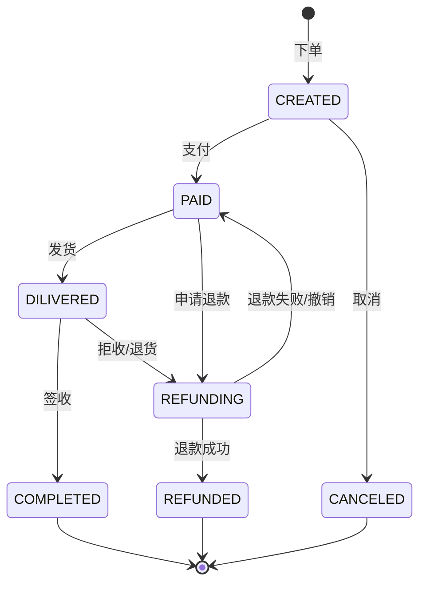
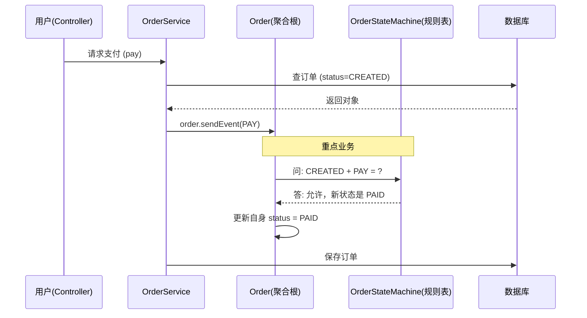
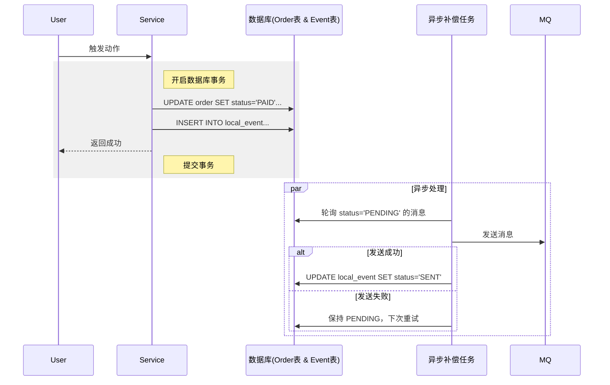

作为一名后端开发者，你一定看过这样的代码：比如你要写一个订单业务，在 `OrderService` 里写了一堆 `if-else` 来判断订单能不能发货、能不能退款。随着业务越来越复杂，这些 `if` 就像面条一样缠在一起，改一个地方崩三个地方，这种代码非常不健康。

我们要用 **DDD（领域驱动设计）** 的思想，配合 **状态机模式**，让你的业务代码更健壮。

## 背景

假如你有个订单业务，订单有以下几种状态：
1. **CREATED:** 待支付
2. **PAID:**  已下单，待接单
3. **ACCPETED:** 已接单
4. **DELIVERED:** 已送出
5. **COMPLETED:** 已完成
6. **CANCELLED:** 已取消
7. **REFUNDED:** 已退款

用户事件：
- **支付：** 把 `CREATED` 变成 `PAID`。
- **收货：** 把 `DELIVERED` 变成 `COMPLETED`，或者把 `CREATED` 变成 `CANCELLED` 。
- **退款：** 把 某一状态 变成 `REFUNDED`。
### 以前我们是怎么写的：

这是典型的“三层架构”写法。

**Order.java (实体类，只有Getter/Setter)** 
```java
// 这就是所谓的“贫血模型”，它只是数据的搬运工，没有脑子
@Data
public class Order {

    private Long id;
    private String status; // 状态直接存字符串或者常量数字
    // public static final Integer PENDING_PAYMENT = 1;...
}
```

**OrderServiceImpl.java (Service层的业务逻辑)**
```java
@Service
public class OrderService {
    @Autowired private OrderMapper orderMapper;

    // 处理支付逻辑
    public void pay(Long orderId) {
        Order order = orderMapper.selectById(orderId);
        
        // 痛点：大量的状态判断逻辑散落在 Service 层
        if (!"CREATED".equals(order.getStatus())) {
            throw new BusinessException("只有待支付的订单才能支付！");
        }
        
        // 痛点：直接操作 Set 方法，任何代码都能随意改状态，很不安全
        order.setStatus("PAID"); 
        orderMapper.updateById(order);
    }

    // 处理收货逻辑
    public void receive(Long orderId) {
        Order order = orderMapper.selectById(orderId);
        
        // 又是重复的判断逻辑...
        if ("CREATED".equals(order.getStatus())) {
            throw new RuntimeException("还没付钱呢，不能收货！");
        }
        if ("COMPLETED".equals(order.getStatus())) {
            throw new RuntimeException("已经收过货了！");
        }

        order.setStatus("COMPLETED");
        orderMapper.updateById(order);
    }
}
```

### 这种写法的问题：

- **逻辑分散**：判断能不能支付、能不能收货的逻辑都在 Service 里，如果你的系统里有 5 个地方都能触发支付，你就要写 5 遍 `if` 判断。
- **不安全**：谁都可以调用 `order.setStatus("随便啥")`，数据很容易搞乱。如果不小心在“已取消”状态执行了“发货”，系统就会崩溃或产生脏数据。
- **难以维护和扩展**：如果需要新增一种订单状态，而这种状态夹在现有状态中间，需要大改业务代码和判断逻辑。

为了解决这个问题，我们需要引入两个核心工具：**领域驱动设计 (DDD)** 和 **状态机 (State Machine)**。
## DDD 与状态机

在优化代码前，先明白几个术语：

| 名词      |  术语            | 通俗解释                                                                |
| :------ | :------------- | :------------------------------------------------------------------ |
| **聚合根** | Aggregate Root | 就是那个**实体类**（这里是 `Order`）。在 DDD 里，主角要有“脑子”，逻辑要写在它里面，而不是写在 Service 里。 |
| **状态**  | State          | 订单现在的样子，比如“待支付”。                                                    |
| **事件**  | Event          | 触发变化的动作，比如“用户支付”。                                                   |
| **流转**  | Transition     | 从 A 状态变成 B 状态的过程。                                                   |
| **卫语句** | Guard          | 门卫。在变状态前检查一下合不合法（比如：没付钱不能发货）。                                       |

### DDD 聚合根

在 DDD 中，**聚合根 (Aggregate Root)** 是业务逻辑的最小边界。它必须保证其内部数据的**完整性**和**一致性**。 订单 (Order) 就是一个典型的聚合根。在 DDD 看来，状态的变更不应该是 Service 层手动 `setStatus`，而应该是聚合根对外部事件的响应。

### 状态机

**状态机（State Machine）** 是一个经典概念，它由三个核心要素组成：
1. **State**：实体所处的状况（如：待支付、已支付、已发货）。
2. **Event**：触发状态流转的动作（如：支付、发货、收货）。
3. **Transition**：从一个状态变为另一个状态的过程，通常伴随着 **Guard** 和**Action**。

### DDD 与状态机的结合点

在 DDD 中，**聚合根** 负责维护数据的一致性。状态是聚合根最核心的属性之一。

将状态机引入 DDD，主要遵循以下原则：
1. **状态即语言**：状态枚举（Enum）和触发事件（Event）应该是领域专家和开发者共同认可的通用语言。
2. **显式流转**：禁止直接 `setStatus`。状态的改变必须通过触发“事件”来完成。
3. **逻辑内聚**：状态机配置（谁能流转到谁）应该属于领域层，而不是应用层。

## 实战架构设计

一个简单的电商订单生命周期：


我们要实现的流程：




我们的目标是：**把逻辑从 Service 挪进 Order 类里，并用一张“配置表”来管理状态变化。**

### 第一步：定义枚举

不要用字符串 "PAID"，要用枚举。
```java
// 状态枚举
public enum OrderStatus {
     CREATED, 
     PENDING_ORDER, 
     ACCPETED, 
     DELIVERED, 
     COMPLETED, 
     CANCELLED, 
     REFUNDED
}

// 事件枚举
public enum OrderEvent {
    PAY,       // 支付
    RECEIVE,   // 收货
    REFUND     //退款
}
```

### 第二步：设计状态机

我们要告诉程序：**在什么状态下，发生什么事件，变成什么新状态**。
现有的状态机框架有 **Spring Statemachine** 和 阿里的 **Cola StateMachine** 等。
但是，我们现在不用复杂的框架，写一个简单的静态映射表。

```java
public class OrderStateMachine {
    // 映射表：当前状态 -> (发生事件 -> 下一个状态)
    private static final Map<OrderStatus, Map<OrderEvent, OrderStatus>> TRANSITIONS = new HashMap<>();

    static {
        // 规则1：如果是 CREATED 状态，发生了 PAY 事件，变成 PAID
        addTransition(OrderStatus.CREATED, OrderEvent.PAY, OrderStatus.PAID);
        // 规则2：如果是 DILIVERED 状态，发生了 RECEIVE 事件，变成 COMPLETED
        addTransition(OrderStatus.PAID, OrderEvent.RECEIVE, OrderStatus.COMPLETED);
        // 规则3：如果是 PAID/DELIVERED 状态，发生了 REFUND 事件，变成 REFUNDED
        addTransition(OrderStatus.PAID, OrderEvent.REFUND, OrderStatus.REFUNDED);
    }

    private static void addTransition(OrderStatus current, OrderEvent event, OrderStatus next) {
        TRANSITIONS.computeIfAbsent(current, k -> new HashMap<>()).put(event, next);
    }

    // 核心方法：获取下一个状态
    public static OrderStatus getNextStatus(OrderStatus current, OrderEvent event) {
        Map<OrderEvent, OrderStatus> eventMap = TRANSITIONS.get(current);
        if (eventMap == null || !eventMap.containsKey(event)) {
            // 如果表里没配这条规则，说明是不合法的操作
            throw new RuntimeException("当前状态 " + current + " 不能进行 " + event + " 操作");
        }
        return eventMap.get(event);
    }
}
```

### 第三步：改造 Order 类

现在的 `Order` 不再只是 getters/setters 了，它有了行为。

```java
// 一个 DDD 风格的聚合根
@Data
public class Order {
    private Long id;
    private OrderStatus status;

    public Order() {
        this.status = OrderStatus.CREATED;
    }

    // 对外不提供 setStatus，只提供业务
    // 外部只能告诉 Order 发生了什么事件
    public void sendEvent(OrderEvent event) {
        // 1. 问状态机：下一个状态是什么（包含校验逻辑）
        OrderStatus nextStatus = OrderStateMachine.getNextStatus(this.status, event);
        
        // 2. 只有这里能修改状态，保证业务安全
        this.status = nextStatus;
        
        System.out.println("订单 " + id + " 状态流转成功：" + event + " -> " + this.status);
    }
}
```

### 第四步：新版的 Service（变得极简）

Service 不再负责复杂的判断，它只负责从数据库查到聚合根，然后触发事件。

```java
@Service
@Transactional
public class OrderService {
    @Autowired private OrderMapper orderMapper;

    public void pay(Long orderId) {
        // 1. 取出聚合根
        Order order = orderMapper.selectById(orderId);
        
        // 2. 触发事件（逻辑都在 Order 和 状态机里，Service 不用操心 if-else）
        order.sendEvent(OrderEvent.PAY);
        
        // 3. 保存状态
        orderMapper.updateById(order);
    }

    public void receive(Long orderId) {
        Order order = orderMapper.selectById(orderId);
        
        // 只要调用同一个方法，传入不同事件即可
        order.sendEvent(OrderEvent.RECEIVE);
        
        orderMapper.updateById(order);
    }
    
    public void refund(Long orderId) {
	    Order order = orderMapper.selectById(orderId);
        
        // 只要调用同一个方法，传入不同事件即可
        order.sendEvent(OrderEvent.REFUND);
        
        orderMapper.updateById(order);
    }
}
```

### 与原来对比

| 特性       | 旧写法                     | DDD + 状态机                           |
| :------- | :---------------------- | :---------------------------------- |
| **代码位置** | 逻辑散落在 Service 的各个方法里    | 逻辑内聚在 `Order` 类和 `StateMachine` 配置里 |
| **可读性**  | 满屏的 `if (status == 1)`  | 清晰的 `Map` 配置表，一眼看出业务流程              |
| **扩展性**  | 加个新状态要改好几个 Service 方法   | 只需要在配置表里加一行代码                       |
| **安全性**  | 任意代码都能 `setStatus`，容易改错 | 禁止 `setStatus`，只能通过合法事件驱动           |
| **复用性**  | 别的 Service 要用还得重写判断逻辑   | 直接复用 `Order` 类的方法                   |

## 这种模式的挑战

在分布式环境下，状态机面临以下挑战：
### 状态竞争 (并发)

当两个线程同时尝试更新同一个订单的状态时（如用户点击取消的同时，支付回调到达）的时候:

在数据库上加乐观锁，增加 `version` 字段。
```sql
UPDATE orders SET status = 'PAID', version = version + 1 WHERE id = 1 AND version = 5;
```

### 幂等性

如果支付回调由于网络原因重试(支付回调来了两次)，状态机已经处于 `PAID` 了，再次收到 `PAY_SUCCESS` 的时候：

状态机引擎应具备“自动过滤”功能。如果当前状态已是目标状态，直接返回成功，不触发 Action。

```java
public void handlePaymentCallback(Long orderId) {
    Order order = orderMapper.selectById(orderId);
    
    // 幂等性检查：如果已经是 PAID，直接返回成功，不做任何副作用
    if (order.getStatus() == OrderStatus.PAID) {
        log.info("订单 {} 已经是支付状态，忽略重复回调", orderId);
        return; // 直接结束，视为成功
    }

    // 正常的流转逻辑...
    order.sendEvent(OrderEvent.PAY);
    // ...
}
```

### 副作用与持久化

状态转换成功了，但发送消息队列失败的时候：
```java
// 错误示范
@Transactional
public void pay(Long orderId) {
    updateDbStatus(orderId, "PAID"); // 1. 数据库事务未提交
    mqProducer.send("OrderPaid");    // 2. 发送MQ消息
    // 3. 如果这里代码报错了，或者数据库提交失败了：
    // 结果：数据库回滚（还是待支付），但 MQ 发出去了（消费者以为支付了）。
    //       或者反过来：数据库成功，MQ 发送因为网络超时失败。
}
```

**解决方案：本地消息表：**
把“发消息”这个动作，变成“往数据库插一条记录”。这样数据库的状态更新和消息记录就在**同一个事务**里，失败就都回滚。

**建表**：`local_event_table` `(id, event_content, status)`。
**Service 层**：
```java
@Transactional(rollbackFor = Exception.class)
public void pay(Long orderId) {
    Order order = orderMapper.selectById(orderId);
    
    // 1. 更新订单状态
    int rows = orderMapper.updateStatusSafe(orderId, OrderStatus.PAID, order.getVersion());
    if (rows == 0) throw new OptimisticLockException("...");

    // 2. 不要直接发 MQ，而是保存一条“待发送消息”到数据库
    LocalEvent event = new LocalEvent();
    event.setTopic("OrderPaid");
    event.setContent(JSON.toJSONString(order));
    event.setStatus("PENDING");
    eventMapper.insert(event); 
    
} // 3. 事务提交
```

**异步线程**：  
写一个定时任务（或者监听器），专门去查 `local_event_table` 里 `PENDING` 的消息，发送给 MQ，发送成功后再把表里的状态改为 `SENT`。

可靠的状态变更


### 复杂条件判断

不是所有 `CREATED` 都能变 `PAID`。  
业务规则：**只有金额 > 0 且 库存充足** 才能支付。如果把这些逻辑写死在 `if-else` 里，Service 又乱了。

使用**策略接口注入**。
在状态机定义里，加入一个 `Condition` 接口。

```java
// 1. 定义条件接口
@FunctionalInterface
public interface TransitionCondition<T> {
    boolean isSatisfied(T context);
}

// 2. 状态机配置类增强
public class OrderStateMachine {
    // 存储：状态 -> (事件 -> {目标状态, 校验逻辑})
    static class Transition {
        OrderStatus target;
        TransitionCondition<Order> condition;
    }
    
    // 配置流转
    static {
        // 只有库存足够，才能从 CREATED -> PAID
        addTransition(OrderStatus.CREATED, OrderEvent.PAY, OrderStatus.PAID, 
            (order) -> order.getAmount() > 0 && InventoryService.check(order.getId())
        );
    }
}

// 3. 调用
public void pay(Order order) {
    // 状态机内部会自动执行 isSatisfied()
    // 如果返回 false，抛出异常 "条件不满足：库存不足"
    order.sendEvent(OrderEvent.PAY); 
}
```

## 最后

1. **不要过度设计**。如果你的状态只有 2 个（开/关），或者订单只有几个状态，用简单的 `if-else` 也没问题。当状态很多且流转复杂时，状态机才是神器。
2. 试着把业务逻辑写进实体类里，而不是全部堆在 Service 里，这是写 DDD 的第一步。
3. **持久化**。数据库里存的还是简单的字符串或数字（比如 `status="PAID"`），状态机只是内存里的逻辑校验器，不需要把状态机存到数据库里。

通过这种方式，你的代码不再是面条，冗长难以维护和扩展，而是一台精密的仪器，每个部件各司其职。这就是架构设计的精妙之处。

