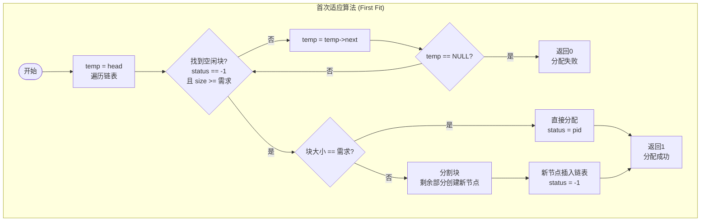
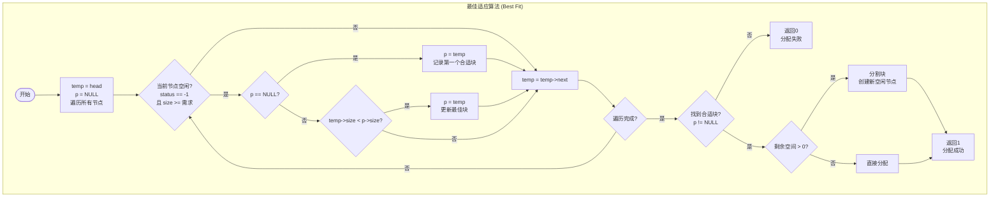
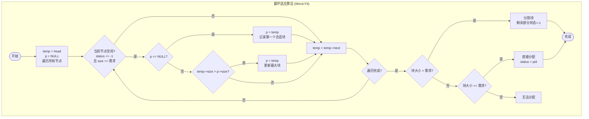
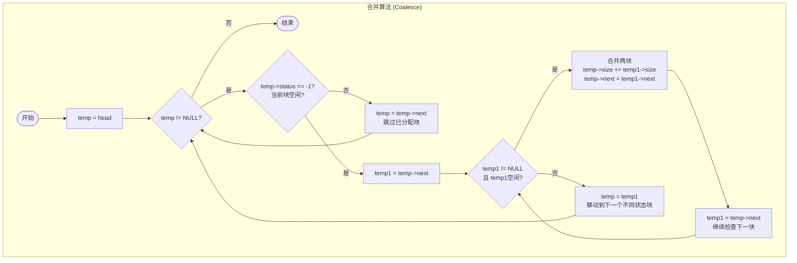
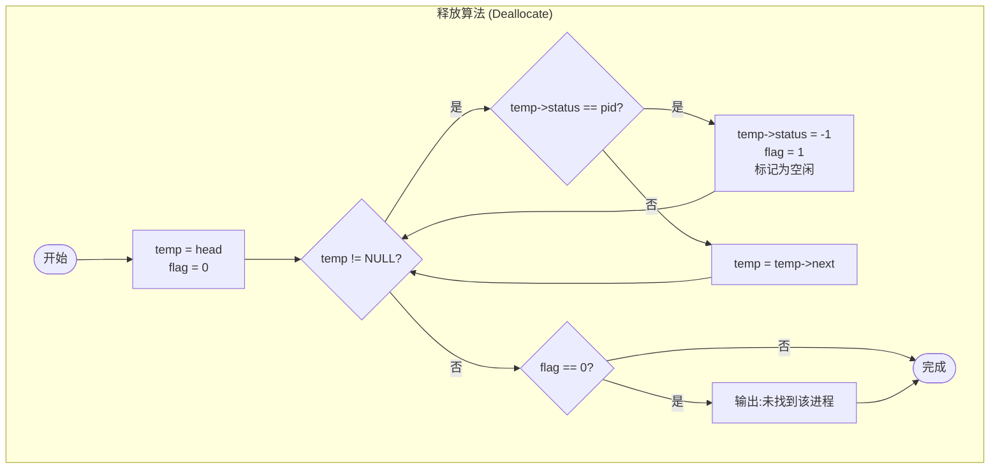
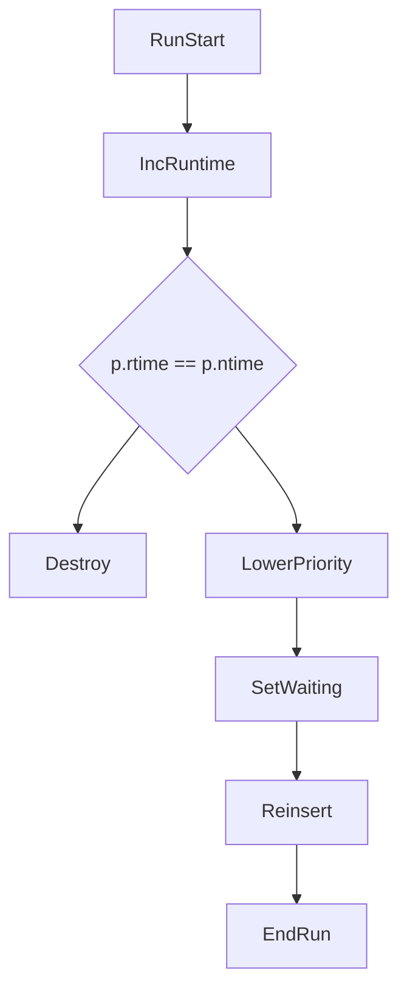

Welcome to fallensakura715's first post.
---


## 获取 github 用户 contributions 记录

### 基本信息

URL:          https://github-contrib.falnsakura.top/
Method:    GET
### 请求参数

**Query**

| 参数名  | 类型     | 必填  | 说明         |
| ---- | ------ | --- | ---------- |
| user | string | 是   | GitHub 用户名 |
```bash
GET https://github-contrib.falnsakura.top/?user={USERNAME}
```

```bash
curl "https://github-contrib.falnsakura.top/?user={USERNAME}"
```

下面给你 **完整的 Mermaid 流程图代码**，分为：

- **主流程 main()**
    
- **input()**
    
- **sort()**
    
- **running()**
    

你可以直接复制到 Markdown 文件或 VSCode + Mermaid 插件里即可看到图像。

---

# 🌟 **1. 主流程 main() — Mermaid**








---

# 🌟 **3. sort() — 按优先级插入单链表**

```mermaid
graph TB
	subgraph Dealloc["释放算法 (Deallocate)"]
	    SortStart --> CheckHead
	    CheckHead --> InsertHead
	    CheckHead --> ScanList
	    ScanList --> InsertTail
	    ScanList --> ComparePriority
	    ComparePriority --> InsertMiddle
	    ComparePriority --> MoveNext
	    MoveNext --> ScanList
	
	    CheckHead{Insert at head?}
	    ScanList{second != NULL}
	    ComparePriority{p.super > second.super}

```

---

# 🌟 **4. running() — 执行一次调度**

