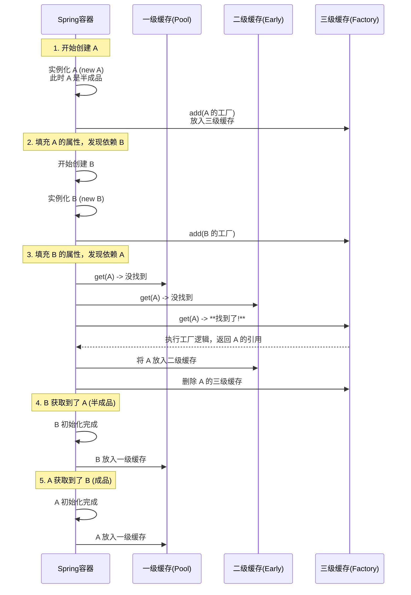

## 什么是循环依赖

循环依赖就是你需要实例化 `A` 的时候，`A` 需要实例化 `B` ，实例化 `B` 又需要 `A` 的实例。这就像是一个“死锁”或者“无限递归”的过程。

在 Java 开发中，如果我们写出如下代码，必然会报 `StackOverflowError`：

```java
public class A {
    private B b;
    public A() { this.b = new B(); } // 构造器里循环依赖，死锁
}
public class B {
    private A a;
    public B() { this.a = new A(); }
}
```

但在 Spring 中，使用 `@Autowired` 进行**属性注入**时，神奇的事情发生了：

```java
@Service
public class ServiceA {
    @Autowired
    private ServiceB serviceB;
}

@Service
public class ServiceB {
    @Autowired
    private ServiceA serviceA;
}
```

上述代码能完美运行。Spring 究竟施了什么魔法，打破了“鸡生蛋，蛋生鸡”的死循环？

答案在Spring Bean 的**生命周期**与**三级缓存**设计中。

## Bean 的生命周期

要理解循环依赖，必须先明确 Bean 创建的两个关键步骤（简化版）：

1. **实例化：** 对应方法 `createBeanInstance`。 执行构造函数 `new Object()`。此时对象已经存在于堆内存，但属性都是 null。这个对象被称为**原始对象**。
2. **属性填充：**  对应方法 `populateBean`。 执行 `@Autowired` 注入，将依赖注入进去。如果依赖的对象还没创建，就会暂停当前 Bean 的创建，转而去创建依赖的 Bean。
3. **初始化：** 对应方法 `initializeBean`。 执行 `BeanPostProcessor` 的后置处理（如 AOP 代理生成）、`InitializingBean` 接口回调等。

**Spring 解决循环依赖的核心思想是：**

> **将“实例化”和“属性填充”分开。**  
> 当 ServiceA **实例化**后，虽然它还不完整（属性没填，初始化没做），但它的内存引用地址已经确定了。Spring 提前把这个 **“早期引用”** 暴露出来，让 ServiceB 先拿着引用，从而打通闭环。

## 三级缓存的结构

打开 `DefaultSingletonBeanRegistry` 类，Spring 使用了三个 Map 来存储 Bean，也就是所谓的“三级缓存”。

**DefaultSingletonBeanRegistry.java**
```java
// 一级缓存：成品池。存放已经经历了完整生命周期(实例化 -> 属性填充 -> 初始化)的 Bean
private final Map<String, Object> singletonObjects = new ConcurrentHashMap<>(256);

// 二级缓存：半成品池。存放早已被实例化，但还没属性填充的 Bean
// 这里存放的对象，可能是原始对象，也可能是被 AOP 提前代理过的对象。
private final Map<String, Object> earlySingletonObjects = new HashMap<>(16);

// 三级缓存：工厂池。存放的是 ObjectFactory，是一个 Lambda 表达式
// 它的作用是：生成半成品的引用。如果有 AOP，它会生成代理对象；如果没有，它直接返回原始对象。
private final Map<String, ObjectFactory<?>> singletonFactories = new HashMap<>(16);
```

### 为什么需要三个 Map ？

- **一级缓存**：毫无疑问，用于存放最终可用的 Bean。
- **二级缓存**：为了保证单例的唯一性。
- **三级缓存**：为了解决 AOP 代理问题。

很多人说“为了解决循环依赖”，这不全对。**如果仅仅是为了解决循环依赖，两级缓存就够了。第三级缓存是为了解决 AOP 代理问题。**

详看下文[三级缓存](##为什么需要三级缓存)

## 创建 Bean 的流程

假设我们要创建 Bean `A`，它依赖 `B`；而 `B` 又依赖 `A`。

### 此时发生的事



### 关键源码：getSingleton

当 `B` 需要注入 `A` 时，会调用 `getSingleton("a")`，这是一个递归查找的过程：

**DefaultSingletonBeanRegistry.java**
```java
protected Object getSingleton(String beanName, boolean allowEarlyReference) {
    // 1. 先去一级缓存拿
    Object singletonObject = this.singletonObjects.get(beanName);
    
    // 2. 如果一级没拿到，且 A 正在创建中 (isSingletonCurrentlyInCreation)
    // 只有发生了循环依赖，才会进入这个分支
    if (singletonObject == null && isSingletonCurrentlyInCreation(beanName)) {
        // 3. 去二级缓存拿
        singletonObject = this.earlySingletonObjects.get(beanName);
        
        // 4. 二级也没拿到，但允许提前引用 (allowEarlyReference = true)
        if (singletonObject == null && allowEarlyReference) {
            synchronized (this.singletonObjects) { // 加锁双重检查
                // ... 重复检查一级二级 ...
                
                // 5. 去三级缓存拿工厂
                ObjectFactory<?> singletonFactory = this.singletonFactories.get(beanName);
                if (singletonFactory != null) {
                    // 6. 【关键】调用工厂的 getObject() 方法，生成对象
                    // 这一步可能会触发 AOP 代理的提前创建
                    singletonObject = singletonFactory.getObject();
                    
                    // 7. 升级：放入二级，移除三级
                    // 为什么放二级？因为工厂执行一次就够了，
					// 如果还有 C 依赖 A，直接从二级拿这个已经处理好的对象即可。
                    this.earlySingletonObjects.put(beanName, singletonObject);
                    this.singletonFactories.remove(beanName);
                }
            }
        }
    }
    return singletonObject;
}
```

## 为什么需要三级缓存

如果 `A` 没有被 AOP 代理，确实二级缓存就够了：

> 实例化 A -> 放二级 -> 创建 B -> B 取二级里的 A -> B 完成 -> A 完成。

**但是，如果 A 被 `@Transactional` 或 AOP 切面代理了呢？**

在 Spring 中，正常的 AOP 代理是在 Bean **初始化后** 的 `BeanPostProcessor` 中完成的。也就是说，**代理对象通常是在生命周期的最后一步生成的。**

**这就出现了一个悖论：**

1. 正常流程：A 实例化 -> 属性填充 -> 初始化 -> **生成 A_Proxy** -> 放入一级缓存。
2. 循环依赖流程：A 实例化 -> 属性填充 -> B 需要 A -> **B 此时就要拿到 A**。
3. **冲突点**：如果 B 此时拿到的是 A 的原始对象，而最后 A 初始化完变成了 `A_Proxy`，那么：
    - 单例池（一级缓存）里存的是 `A_Proxy`。
    - B 对象里引用的却是 `原始 A`。
    - **结果**：当你调用 `b.getA().method()` 时，AOP 增强逻辑（如事务）失效。

**三级缓存的 `ObjectFactory` 就是为了解决这个“时机”问题。** 它提供了一个回调机制。

看一下放入三级缓存的那个 Lambda 表达式，Spring 在实例化 A 之后，立刻将其放入三级缓存：

**AbstractAutowireCapableBeanFactory.java**
```java
// doCreateBean 方法内
addSingletonFactory(beanName, () -> getEarlyBeanReference(beanName, mbd, bean));
```

这个 `getEarlyBeanReference` 是核心：

```java
protected Object getEarlyBeanReference(String beanName, RootBeanDefinition mbd, Object bean) {
    Object exposedObject = bean;
    if (!mbd.isSynthetic() && hasInstantiationAwareBeanPostProcessors()) {
        for (BeanPostProcessor bp : getBeanPostProcessors()) {
            if (bp instanceof SmartInstantiationAwareBeanPostProcessor) {
                // 如果有 AOP，这里会提前创建代理对象
                exposedObject = ((SmartInstantiationAwareBeanPostProcessor) bp).getEarlyBeanReference(exposedObject, beanName);
            }
        }
    }
    return exposedObject;
}
```

### 结论：
第三级缓存存放的 `ObjectFactory` 提供了一个 **后悔** 机制。

- 如果没发生循环依赖，这个工厂根本不会被调用，AOP 依然在生命周期最后正常进行。
- 如果发生了循环依赖（B 需要 A），B 会去三级缓存调用 `getObject()`，**强行触发** `getEarlyBeanReference`，**提前**把 A 的代理对象创建出来给 B 用。

## 哪些循环依赖解决不了

Spring 的这套机制不是万能的，以下情况会报错：

1. **构造器注入：**

	```java
	@Service
	public class A {
	    public A(B b) { ... } // 报错
	}
	```
	
	**原因**：Spring 必须先实例化 A，才能放入三级缓存。构造器执行不完，对象就无法实例化，也就没机会放缓存。
	**解决**：使用 `@Lazy` 注解。`public A(@Lazy B b)`。这会注入一个 B 的代理，真正调用时才去容器找 B。
2. **`@Prototype` 作用域：**  
    原因：Spring 不会缓存多例（Prototype）对象，每次都 new，自然无法利用缓存机制打破闭环。
## Spring Boot 2.6+ 的变化

值得注意的是，从 **Spring Boot 2.6.0** 开始，**默认禁止循环依赖**。

如果你的项目中存在循环依赖，启动时会直接报错： `Relying upon circular references is discouraged and they are prohibited by default.`

官方建议通过重构代码（如提取公共类、使用事件驱动等）来解决。如果非要兼容旧代码，需要在 `application.properties` 或 `yaml` 中配置：

```yaml
spring:
  main:
    allow-circular-references: true
```
## 总结

1. **核心手段**：Spring 利用 **三级缓存** 解决了 **单例模式** 下的 **属性注入** 循环依赖问题。
2. **原理：** 通过“实例化”与“初始化”分离，利用 **中间态（半成品）** 对象来打破引用环。
3. **三级缓存**：
    - 一级：最终成品。
    - 二级：提前暴露的 Bean（可能是原始的，也可能是代理的），保证多重循环依赖时的引用唯一性。
    - 三级：**工厂**。本质是为了 **在 AOP 场景下，能够延迟决策对象的最终形态（是原始对象还是代理对象）**，并在出现循环依赖时“被迫提前”创建代理对象。
